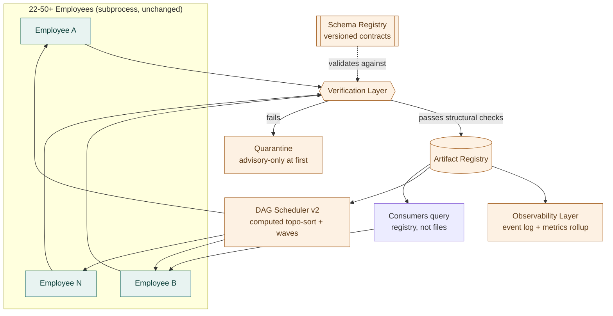

# AOS v2 — Next-Generation Platform Architecture

**Status: design only. Nothing in this document is built.** This is a
response to an explicit architectural review request, written the same
way `evidence-intelligence/evidence-intelligence-architecture.md` was:
investigated in depth, nothing implemented, no new AI employee added
(per instruction), and every claim about the current system traced to
real code, not assumed.

This document covers item 1 of a seven-part review
(`architecture → verification engine → artifact registry → enterprise
review → AOS 2030 → ADR library → red-team critique`). Items 2–7 are
each their own design exercise and are explicitly out of scope here;
where this document needs to describe a future component that one of
those items will design in full (the Verification Layer, the Artifact
Registry), it describes that component's *shape and interface only* —
enough to reason about the whole architecture, not a finished design.

## The one honest caveat before anything else

AOS today is 22 employees, ~528 tests, and a full daily run that
finishes in **under five seconds** of wall-clock subprocess time. It
is operated by one founder, for one practice, with zero ops team and
zero infrastructure budget beyond a GitHub Actions runner. Every
recommendation below is written against that reality, not against an
imagined 50-employee, multi-tenant future that may or may not arrive.
Where a component below would only earn its complexity cost at real
scale, that is stated explicitly, and the Implementation Roadmap
separates "worth doing at today's 22 employees" from "correctly
deferred until there is real signal of needing it." Building
Kubernetes-grade infrastructure for a system that runs in five seconds
a day would itself be the kind of engineering-elegance-over-revenue
mistake this whole program has been built to avoid.

## What Actually Breaks Between 22 and 50+ Employees

Four structural limits, each demonstrated with a real, currently-live
example rather than a hypothetical:

### 1. The dependency graph is a hand-maintained array, not a computed graph

`orchestrator-config.json` is 298 lines today, encoding execution
order as a flat JSON array plus per-employee `dependsOn` lists. Nothing
validates that an employee's dependencies actually appear *earlier* in
that array. They don't, right now, in production:

```
reverse-job-hunt   (array position 8)  depends on
relationship-intelligence (array position 11)
```

`relationship-intelligence` runs *after* `reverse-job-hunt` in every
real run, so `reverse-job-hunt` is permanently `SKIPPED_DEPENDENCY_FAILED`
— confirmed still present in the last several committed
`status.json` snapshots, unnoticed because `SKIPPED_DEPENDENCY_FAILED`
looks enough like a legitimate state that nobody investigated it. At
22 employees this is one silent gap. At 50+, hand-verifying that a
298-line array (which would be 700+ lines) stays topologically
consistent every time someone adds an employee is not a process a
human can reliably run.

### 2. Cross-employee contracts are hardcoded file paths, not versioned schemas

Every employee reads another's output as a literal path string:
`AOS_DIR / "other-employee" / "output" / "thing.json"`. There is no
schema version, no compatibility check, no registry — just a filename
convention enforced by whoever wrote the code that day. Every JSON
store documents its shape as a hand-written `"schema"` comment block
inside the file itself (see `demand-intelligence/opportunity-
schema.json`), which is good discipline but zero *enforcement*:
nothing stops the shape and the comment from drifting apart, and
nothing warns a consumer when a producer's shape changes underneath
it.

The clearest proof this is fragile: this week's task was "move where
output files live" — a pure path rename, no logic change — and it
required coordinated edits across roughly 40 files (24 producers, ~20
cross-employee references, the orchestrator config, the dashboard's
own manifest, and doc comments), because every one of those was an
independent, hardcoded string with no single source of truth. At 22
employees that was an afternoon's careful mechanical work. At 50+, a
schema or path change of that shape stops being tractable by hand.

### 3. Execution is strictly sequential regardless of what the graph allows

`orchestrator.py` runs employees one at a time, in array order, purely
because that was simplest to reason about at 22 employees running in
under five seconds. Many of those 22 have no dependency relationship
to each other at all (e.g. `tender-intelligence` is self-contained;
`fractional-advisory-radar` and `recruiter-intelligence` don't depend
on each other) and could run concurrently today with zero risk. That
slack doesn't matter yet — five seconds either way is invisible. It
will matter once individual employees do real work that takes real
time (an LLM-backed extraction step, an external API call with
latency, a heavier scoring pass) and once there are enough of them
that sequential execution is the dominant cost.

### 4. "Never fabricate" is enforced by code review, not by the runtime

Nothing structural stops a future employee (written by someone other
than the person who has internalized this project's conventions
through 24 sprints of doing it by hand) from writing `score = 7  #
good enough` and shipping it. The discipline has held for 22 employees
because one person wrote all of them and reviewed every line against
the same standard. That does not survive a second author, a
contributor, or a team — which is the real question a 50+-employee,
enterprise-deployed AOS has to answer, independent of raw employee
count.

## New Components

Five additions, each targeting exactly one of the four limits above,
each designed to be **additive to the filesystem**, never a
replacement for it — git-committed Markdown and JSON are still the
system of record; every new component is a structured *index* or
*gate* layered on top, so a single-founder deployment can run without
any of them turned on.



### Schema Registry

Every artifact type (a feed, a report, a delivery kit component) gets a
real JSON Schema, checked in as code — not a comment — with a version
number. A producer declares which version it emits; a consumer
declares the minimum version it can read. This is a formalization of
the comment-block convention already used everywhere in AOS today, not
a new philosophy — it just makes the existing discipline machine-
checkable. Backward-incompatible changes become a version bump the
registry can detect and refuse, rather than a silent shape mismatch
discovered downstream (or not discovered at all).

### Verification Layer

Sits between "an employee finished running" and "the result is visible
to any other employee." Runs structural checks — does the output match
its declared schema version, is every required field present, is a
confidence score attached, does the content contain anything that
looks like a fabricated-pattern placeholder — before promoting a
result from draft to published. Full design (evidence requirements,
claim extraction, failure handling, audit logging) is item 2 of this
review; here it is just a named stage in the pipeline with a clear
promote/quarantine contract, so the rest of this architecture has
somewhere concrete to point.

### Artifact Registry

A structured metadata index over what employees already write to
`output/`. Every artifact gets a stable ID, its producing employee,
schema version, a content hash, the exact upstream artifact
IDs/versions it was computed from (lineage), a confidence score, a
lifecycle state (`draft → published → superseded → archived` — the
same never-delete philosophy `memory-system.md` already documents,
made explicit), and, for multi-client deployments, a client/engagement
scope. Consumers query the registry ("give me the latest published
`account-intelligence-brief` for organisation X with confidence ≥
0.7") instead of constructing a file path and hoping it exists. Full
design is item 3 of this review; the load-bearing architectural
decision made here is that **the registry is additive metadata, not a
new data store** — the Markdown/JSON keeps living exactly where it
does today, git-committed and human-readable, and the registry is a
derived index that can be rebuilt from disk at any time and thrown away
without data loss.

### Observability Layer

Today, AOS's entire operational history is one log file and one
`status.json` per run, both overwritten or freshly dated each day —
excellent for "what happened on this exact date," poor for "how has
Employee X's failure rate trended over the last quarter" without
grepping 90 committed Markdown files by hand. The Observability Layer
adds one structured, appendable JSONL event stream per run (employee,
duration, status, retries, artifact IDs touched) and a rollup that
recomputes trailing-window metrics from it — still filesystem-based,
still git-committed, just structured enough to query instead of only
read.

### DAG Scheduler v2

Replaces the fixed sequential array with a graph computed from each
employee's declared dependencies, validated for cycles and ordering
consistency at config-load time (the reverse-job-hunt bug above would
have been a hard failure at startup, not a silent skip discovered by
reading logs), and executed in dependency-respecting **waves** —
employees with no relationship to each other in the same wave run
concurrently, in their own subprocess, exactly as today. This preserves
the one invariant most worth keeping from the current design
(subprocess isolation, never in-process import) while removing the
"someone has to hand-order 50+ entries correctly" requirement.

## Multi-Client Architecture

Today, one repository *is* one client — `pipeline.json`,
`opportunity-schema.json`, and every other store are single global
files scoped to AI for U&I's own practice. There is no `client_id`
anywhere in the schema. Two credible paths, not one default answer:

- **Fork-per-client (no new component)**: today's model, unmodified,
  once per licensed practice. Zero new architecture, zero shared
  infrastructure risk between clients, and it is exactly how AOS
  already works — the honest answer if AOS's actual near-term business
  model is "license the platform, each firm runs its own instance,"
  not "one shared multi-tenant service."
- **Client-scoped registry (real multi-tenancy)**: introduce
  `clientId` as a first-class dimension on every Artifact Registry
  entry and every persistent store, so one deployment serves many
  practices with isolated data. This is a materially larger and
  riskier undertaking than anything else in this document — it changes
  the shape of every existing JSON store, not just adds a layer beside
  them — and should not be attempted until the Artifact Registry
  itself (a smaller, additive, reversible step) has been running in
  production and proven out.

The Implementation Roadmap below treats fork-per-client as the default
and client-scoped registry as an explicit, separately-greenlit later
phase, not a phase 1 assumption.

## Future Extensibility

At 22 employees, `orchestrator-config.json` is already 298 lines of
hand-maintained JSON with long free-text `"note"` fields explaining
each entry's reasoning. That documentation quality is a real asset —
it's how a future reader (human or model) understands *why* each
dependency exists — but the file format doesn't scale linearly forever.
The extensibility answer is not a new plugin framework; it's
formalizing what already exists: each employee gets one manifest
(schema versions produced/consumed, script entrypoint, declared
dependencies) that the DAG Scheduler and Schema Registry both read,
replacing today's single monolithic config with one file per employee
— easier to review in a pull request, easier to diff, and it turns
"add employee #51" into "add one file," not "edit a 700-line array
without breaking anyone else's entry."

## Migration Strategy

Every phase is additive and independently reversible — turned off, the
system behaves exactly as it does today. None require a rewrite of any
existing employee's own scoring/classification logic, matching the
"additive, never destructive" principle that has governed every sprint
so far.

| Phase | What ships | Risk if it goes wrong |
|---|---|---|
| 0 — Schema formalization | Real JSON Schemas generated from today's comment-block documentation, checked but not yet enforced | None — pure documentation, no runtime change |
| 1 — Artifact Registry (shadow mode) | A read-only index built *after* each run from what's already on disk; nothing reads it yet | None — additive, rebuildable, deletable |
| 2 — Verification Layer (advisory) | Structural checks run and logged, but never block promotion | Noise (false-positive flags), not breakage |
| 3 — DAG Scheduler v2 | Computed topo-sort replaces the fixed array; subprocess execution model unchanged | A cycle/ordering bug surfaces as a hard startup failure instead of a silent skip — this is the intended behavior change |
| 4 — Verification Layer (enforcing) | Promotion now genuinely gated on passing checks | An employee's real output could be wrongly quarantined — needs a manual override path from day one |
| 5 — Registry-as-source-of-truth | Employees query the registry instead of parsing files directly | The largest, most invasive phase — do this only after 1–4 have run in production long enough to trust the index |
| 6 (separately greenlit) — Client-scoped multi-tenancy | `clientId` threaded through every store | Out of scope until there is a real second client — see Multi-Client Architecture above |

## Risks

- **Over-building for a five-second system.** The single biggest risk
  in this whole exercise is treating a genuinely small, fast system
  (22 employees, sub-five-second runs, one operator) as if it already
  had Kubernetes/Stripe-scale problems. Every phase above is sized to
  be worth its cost *at the scale it targets* — the roadmap explicitly
  flags which phases are worth starting now versus waiting for real
  signal.
- **Migration cost compounds, not adds.** This week's output-path
  rename — a *simpler* change than anything in this document — touched
  ~40 files and required a live-merge reconciliation against production
  commits that landed mid-refactor. A Registry-as-source-of-truth
  migration (phase 5) is materially larger than that and should be
  budgeted accordingly, not estimated by analogy to a smaller change.
- **Parallelism introduces races the sequential model avoids for
  free.** Several employees still write to shared, non-employee-scoped
  files (`pipeline.json`, `company-intelligence.json`). The DAG
  Scheduler must either keep genuinely shared-file writers in the same
  wave (serialized) or move those writes behind the Artifact Registry
  first — parallelizing before that is solved would introduce data
  races that do not exist today.
- **A verification layer that blocks in enforcing mode (phase 4) can
  itself become the thing that silently drops real data** if it has
  false positives and no override path. The single founder-maintained
  discipline this document is trying to make structural should not be
  replaced by a black box the founder can't see into or overrule.
- **Multi-tenancy is scope creep unless there is a real second
  client.** Building `clientId` support into every store before AOS
  has a second licensed practice is exactly the kind of "engineering
  elegance over revenue" this program was explicitly built to avoid.

## Implementation Roadmap

**Worth doing now, at 22 employees:**
- Phase 0 (schema formalization) — low cost, pays for itself the next
  time any cross-employee contract changes.
- Phase 1 (Artifact Registry, shadow mode) — zero risk, and gives real
  data (actual lineage, actual confidence distributions) to inform
  whether phases 2–5 are worth their cost, instead of guessing.
- Fixing the reverse-job-hunt/relationship-intelligence ordering bug
  directly, today, independent of any of this — it does not require
  DAG Scheduler v2 to fix; it requires re-ordering one array. That fix
  should not wait for this architecture to ship.

**Worth starting once Phase 1 shows real signal:**
- Phase 2 (Verification Layer, advisory) and Phase 3 (DAG Scheduler
  v2) — both meaningfully de-risk growth past 22 employees without yet
  committing to the largest, riskiest phase.

**Correctly deferred until there is a concrete trigger:**
- Phase 4 (enforcing verification) — until Phase 2's advisory data
  shows the false-positive rate is low enough to trust.
- Phase 5 (registry-as-source-of-truth) — the single largest
  architectural change here; only after 1–4 have run in production.
- Phase 6 (client-scoped multi-tenancy) — only once there is an actual
  second client, not in anticipation of one.

The through-line: this document exists to make growth past 22
employees *possible without a rewrite*, not to pre-build
infrastructure for a scale AOS has not yet earned.
